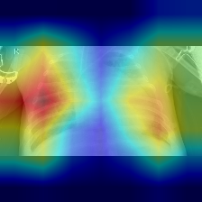

# Chest-xray API

**Tech stack:** PyTorch · FastAPI · Docker · Albumentations · Pytest
Python version : 3.10.12

This project is a binary image classifier built with the ResNet-18 architecture. Its purpose was to gain a deeper understanding of machine learning as part of a complete development and deployment pipeline. After training the model, I created an API using FastAPI and containerized the application with Docker for deployment.


## Task introduction
The task is binary classification of chest X-ray images into two classes: “PNEUMONIA” (patients with pneumonia) and “NORMAL” (unaffected patients).


## Installation

To use the api you can either build a docker image and run it inside a container (from the root of the project):
```bash
docker build -t peteguy/chest-xray .
docker run --name xray -p 8000:8000 peteguy/chest-xray:latest
```

Or you can run it locally by creating your virtual environment and using the following commands (from the root of the project). 

```bash
pip install typing_extensions==4.15.0
pip install torch==2.8.0 torchvision --index-url https://download.pytorch.org/whl/cpu
pip install --no-cache-dir -r requirements.txt
python -m app.main
```
Once the API is up and running, the interactive documentation is available at http://0.0.0.0:8000/docs.

Some sample images from the test set are available in the images folder.


## Model
This section will go over the machine learning part of the project which includes the architecture, the data used and the training. 

### Architecture
The goal of the project was to iterate using one architecture, I chose resnet18 as its lightweight nature allows for rapid training and testing. 
The model is available in the torchvision package, but to better understand it I used a homemade version you can find in the "src/myresnet.py" file.

### Data
The images used are available on [Kaggle](https://www.kaggle.com/datasets/paultimothymooney/chest-xray-pneumonia/data) there are 5863 total. The code for the dataset and data augmentations are defined in the "src/mydataset.py" file.

## Training
The training code is in the "src/exp.py" file. 
Since the dataset is small, I quickly added the use of the imagenet weights for the model and the Albumentation package for data augmentation, the two that I used were horizontal flip and a slight random rotation of up to 10 degrees. 
Regarding the metrics I used the classical **recall** and **precision**, since the problem is of a medical nature, recall would be the priority, as it is far more important to correctly detect all the pneumonia case rather than to avoid wrongly diagnosing a normal patient, even though the final responsability would rest on a human doctor. 
Final metrics: Recall = 0.95, Precision = 0.87 (using an arbitrary threshold of 0.8). 


## Gradcam
As we know modern deep learning model can show behaviors that are hard to decipher. Some methods were developped to offer a way to visalize their inner workings, gradcam is used to visualize on an image the weight of each pixels in the final result. I used it here to familiarize myself with it and to verify that the model was generalizing correctly.


  <b>Figure 1: X-ray of a person suffering from pneumonia</b>

  
  

  
  <b>Figure 2: Gradcam used on the final layer of the resnet18 backbone</b>

  
  


## Future improvements
If this project had to be iterated on further, I would take the following ideas into account which can be prioritized depending on the objective :
- A second training where we unfreeze the resnet18 backbone
- More image transformations, like blurring and random croping which could help learn the features better if used in conjonction with the previous idea
- More powerful architecture, like bigger resnets or transformer based architecture using ViT


## API 
To make the model available to external users it is necessary to build an interface, usually an http API they can interact with. I chose to use the fastapi package which has great features like automatic documentation and robust type checking using pydantic. 

The API includes:

- /metadata: Returns basic information.
- /predict: Handles a single image.
- /predict_batch: Handles multiple images.

I implemented exception handling and tested common edge cases (e.g., invalid file format).

API code is in app/main.py.
Unit tests are implemented with pytest using FastAPI’s TestClient from httpx.


## Deployment

In order to make this API widely usable I used docker containers.
This allows consistent, reproducible deployment with a single command.
